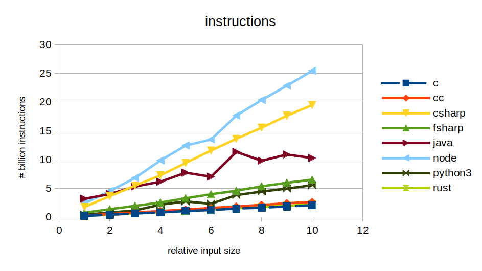
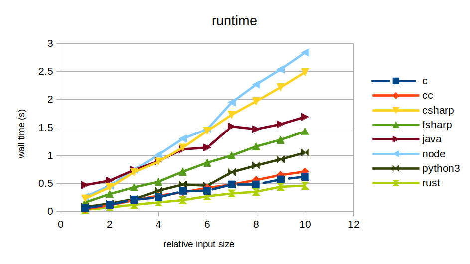

# Sort Benchmark

Benchmark a simple sort program written in various languages. 

## Requirement
- curl
- GNU time
- taskset
- perf
- make
- clang or gcc
- rustc
- jdk
- python3
- node
- dotnet

## How to run
```bash
$ bash run_benchmark.sh
```
This produces two files: `instructions.tsv` and `time.tsv`. These files will have benchmark results in a tab-separated table format, which you can simply import and plot using your favorite plotting tool.

## Benchmark Result on linux-x64
This is what I have got by running on my linux-x64 system.



## Program Specification
The program expects two optional command line arguments. The first is the path to the input file, which is defaulted to read from the standard input if not provided. The second is the path to the output file, which is defaulted to the standard output if not provided. 

The program then sorts input by lines and writes to the output file. For fair comparison, we force single-thread running for the program and will include interpreter/VM overhead as well (i.e., java, python, node, etc)

## Adding another language
Feel free to create PR with your favorite programming language, but please keep in mind
- use the standard library (every language must have built-in library support for reading/writing and sorting, unless it is an assembly language)
- comparison of strings should be either byte-value or utf8-value, whichever the language defaults to.
- prefer quicksort over others
- the implementation should be simple and generic without fancy optimization tricks
- prefer AOT over JIT